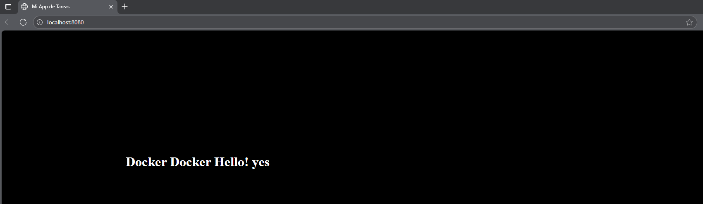
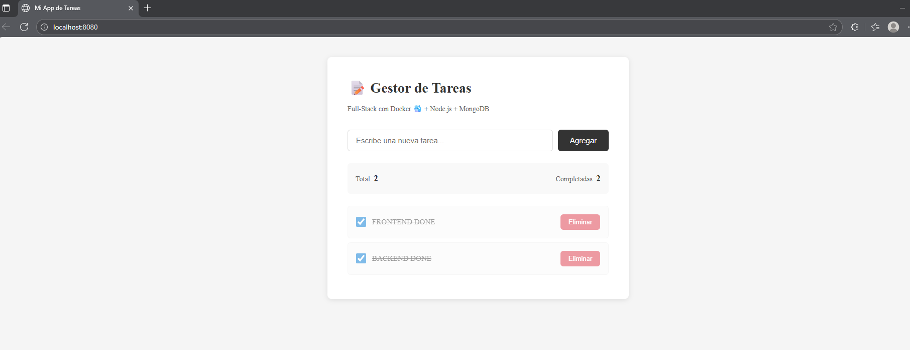
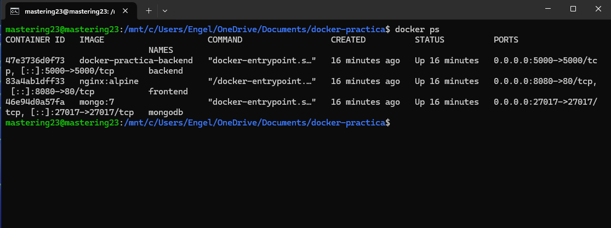
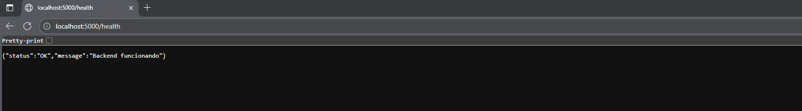
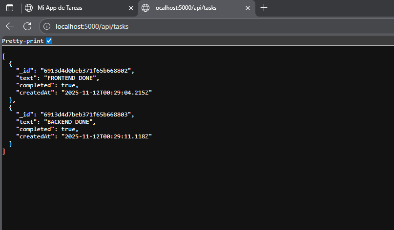
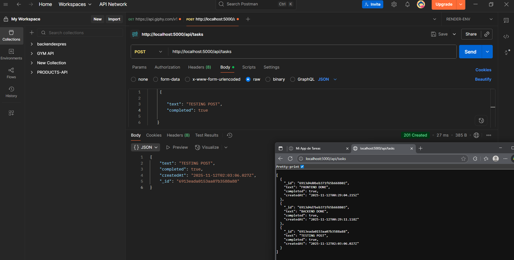

# 🐳 Proyecto Docker - Gestor de Tareas
##### Una aplicación web simple de gestión de tareas corriendo en Docker.
##### 📖 ¿Qué estamos haciendo?
##### Este proyecto demuestra cómo contenerizar una aplicación web usando Docker. En lugar de instalar un servidor web en tu computadora, empaquetamos toda la aplicación (HTML, CSS, JavaScript) junto con un servidor Nginx dentro de un contenedor Docker. Esto significa que:

##### ✅ La aplicación funciona igual en cualquier computadora que tenga Docker
##### ✅ No necesitas instalar ni configurar un servidor web manualmente
##### ✅ El entorno está aislado y es reproducible
##### ✅ Puedes crear, detener y eliminar la aplicación con comandos simples

##### En resumen: Tomamos una app web básica y la "metemos en una caja" (contenedor) que puede ejecutarse en cualquier lugar de manera consistente. Es como crear un paquete completo y portátil de tu aplicación.

### FRONTEND | HTML | CSS | JAVASCRIPT | BACKEND | Node.js + EXPRESS | nginx:alpine | mongodb

FRONTEND RUNNING IN http://localhost:8080/

BACKEND RUNNING IN http://localhost:5000/

